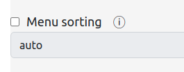
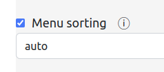
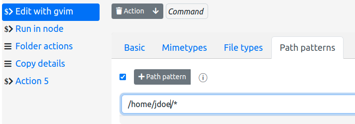
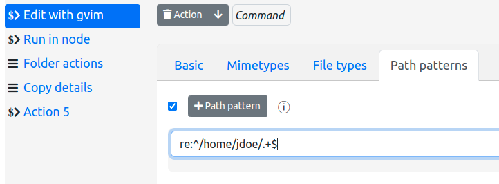
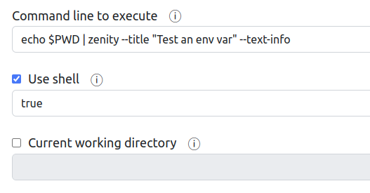

# Actions For Nautilus

The Actions For Nautilus extension allows you to add items to the Gnome Files
(called Nautilus from here-on, to avoid confusion) context menu (i.e. the right click menu)
based upon the characteristics of the files and directories that you have selected
(simply called _files_ from here-on).

Within the context of the extension, these menu items are called _actions_.

You can add two types of actions.

* Commands - a command action allows you to execute an arbitrary command, passing
  the selected files to the command as arguments.
* Menus - a menu action contains other actions, allowing you to structure your
  configured commands into logical groups in any way you see fit.

The configuration of the extension is, effectively, the declaration of the menu and
command actions that you wish to see in the Nautilus context menu for different types 
of files.

The details of the configuration file itself can be found in the project documentation.
This help information is intended to help you use the configurator tool to create and
modify the configuration.

# Table of Contents

* [Configurator Layout](#configurator-layout)
  * [Undo, Redo and Save](#undo-redo-and-save)
  * [Optional parameters](#optional-parameters)
* [Menu Actions](#menu-actions)
* [Command Actions](#command-actions)
  * [Creating a Command Action](#creating-a-command-action)
  * [Filtering rules](#filtering-rules)
      * [Max items](#max-items)
      * [Mimetypes](#mimetypes)
      * [File types](#file-types)
      * [Path patterns](#path-patterns)
  * [Commands](#commands)
    * [Use shell](#use-shell)
    * [Command line placeholders](#command-line-placeholders)

# Configurator Layout
The configurator UI is basically layed out in two columns:

* The left most column shows you the current items that will be added to the Nautilus context menu.
  
  

  This allows you to: 
  
  * see the actions already added to the main context menu, 
  * add new actions to that menu
  * select an existing action in order to edit its characteristics
  * remove all actions from the main menu (which removes all actions from the entire configuration)

  It also allows you to set the ordering options for the main menu actions, and to set the debug
  output option if you need to resolve problems with your configuration (not yet fully implemented).

* The right column shows the details and characteristics of the currently selected main menu item
  in the left-most column

  

  Here you:

  * set the type of the selected action - _Menu_ or _Command_
  * set the label for the action
  * set the submenu items for a menu action
  * set the command string, cwd, and filter rules that pertain to a command action
  * reorder the action within its containing menu
  * delete the action

Of special note is the **Submenu Actions** tab for menu actions ... this presents the identical UI
elements in a nested format - i.e. the creation and manipulation of submenu actions is exactly
the same as for main menu items, performed within the ui presented by the **Submenu Actions** tab.

The instructions below are presented for main menu actions, but the same semantics apply to creating
submenu actions.

## Undo, Redo and Save
Next to the title, you will see three buttons that allow you to undo changes that you have made,
redo changes that you have undone, and save changes back to the configuration file:


The `Show Help` button (which you have already discovered if you are reading this) is also there, and allows
you to hide this help window once you have shown it.

The save button will not be enabled if there are no changes to save, nor if there are problems with the 
configuration. If you have made changes but the save button is disabled, you will need to revisit those
changes and correct the problems that are reported in order to be able to save the configuration.

Once saved, the previous configuration is backed up in the `~/.local/share/actions-for-nautilus` folder:


You can, of course, restore a previous version of the configuration by replacing the file `config.json`
with the contents of a backup file.

You are responsible for deleting backups that are no longer required.

## Optional parameters
You will notice that optional parameters are not automatically enabled for modification. In order to
modify an optional parameter from its default value, you first need to enable the inclusion of the
optional parameter into the configuration by checking the check box associated with that parameter. E.g.:

* disabled:

  

* enabled:

  

Note also that if you disable an optional parameter that you have previously enabled and modified, the
displayed value is _not_ modified to the default value but retains the modified value you previously set.

The saved configuration however will not contain the parameter which, therefore, will revert to its default
value.

# Menu Actions
To create a menu action, then, do the following:

* click on the **+ Action** button at the top of the left-most column of the configurator
  tool:

  

* In the newly-created action details area (to the right), click on the type indicator
  box and change its value to _Menu_:

  

You will now see the tabs that are relevant to menu actions:


You will also notice that the selection item in the left column has a new icon:

 - the menu icon - instead of ,
the command icon.

You must now give your menu a label, which should be unique among all actions in the 
parent menu to which you are adding the menu.

You can also opt to have the extension sort the actions that will appear in this new menu
in alphanumeric order (the default is that the order you specify is the one that is used).

To add actions to your new menu, click on the **Submenu Actions** tab to reveal a nested
panel that is similar to the top level UI. Here you can, again, click on the
 button to configure the actions that will appear in your
newly created menu.

That is all there is to menu creation.

Note, however, that your menu will not appear in the Nautilus context menu until you add command
actions to it, and then only if those commands are pertinent to the files that you have 
selected in the Nautilus window...

# Command Actions
Command actions are really what this is all about - executing a command string of your choice,
passing details of the file(s) you have selected as arguments to the command.

Examples of commands:

* Start an HTTP server using a specific folder as the root folder
* Restore the previous version of a versioned file
* Copying details of the selected files to the clipboard
* Running a script file with an appropriate interpreter
* Executing an arbitrary command in a selected folder
* ...

Using tools such as Zenity, XClip, Gnome Terminal, and others, you can construct complex
scenarios and even pipelines that are then executed with a simply click on the Nautilus
context menu item

## Creating a Command Action
You create a command action in the same way you create a menu action: 

* click on the  button at the top of the left-most column 
  of the configurator tool

* In the newly-created action details area (to the right), click on the type indicator
  box and change it to _Command_

Upon creating the action, you will see the details that can be specified for the command:


(as well as warning that minimal required information has not yet been provided)

Firstly give your command a label, which should be unique within the menu/submenu to which
you are adding the command.

And, evidently, you must provide a command line to execute when the action is clicked on.
We'll cover that below.

Firstly, however, we'll cover the rules that dictate if a command action is applicable to the
current files in the Nautilus selection.

## Filtering rules
Actions For Nautilus can examine the Nautilus selection to decide if a specific command action
should be available to that selection.

This examination can apply four different criteria:

* The number of files in the selection 
* The mimetypes of the selected files
* The basic filetypes of the selected files
* The paths of the selected files

Firstly note that each of these is optional - if not used, the action applies to a selection
of any size, any file type, any mimetype, and any path.

As with other optional configuration items, in order to apply a filter, you must first activate 
the filter by checking the checkbox situated next to the entry field.

After that, you can start adding filter rules.

It is important to note that _all_ files in the selection must pass the filtering rules in 
order for the action to be shown in the Nautilus context menu.

It is also important to note that if none of the actions in a submenu are applicable to the
current selection, that submenu will not appear in the Nautilus context menu.

### Max items


This is pretty simple to explain: the maximum number of files that are in the selection in order 
for the command action to be shown.

Normally you will be looking at values of either **0** - meaning unlimited (the default) - or 
**1** meaning ... well ... 1. However, other values can be used. For example, for an action that 
compares up to two files, you might want to specify a value of **2** here.

Note that, at present, there is no capability to specify an exact number other than **1**, nor to
specify a minimum number.

### Mimetypes

With the mimetypes list, entered in the **Mimetypes** tab, you can specify the IANA Media Types 
to which your command action applies. E.g.


In this example, the **Run in node** action only applies to files whose mimetype is **application/javascript**.

You can specify any number of mimetypes - the selected files must match one of these in order to pass the
mimetypes filter rule.

A mimetype can be declared in one of the ways standard to IANA Media Types:

* _type/subtype_ - a specific mimetype (e.g. **application/javascript** as in the above example)
* _type/\*_ - all subtypes of a specific type (e.g. **audio/\*** for audio files of any encoding)

You can specify **\*** or **\*/\*** to accept all mimetypes - but since this is the default setting
it's a bit superfluous to do so!

You can make a mimetype _"negative"_ by preceding it with an exclamation point, in order to declare 
that NONE of the selected files should be of the specified mimetype(s). E.g.


In this example, the **Edit with gvim** action will not appear if any of the selected files is a PDF, an 
audio file, or an image file.

You should probably avoid mixing standard (positive) rules with negative rules, since the result could
be confusing, but the algorithm is fairly straightforward: All selected files must match one of the 
"positive" rules, if any, and none of the "negative rules".

Note that negative rules take precedence over "positive" rules - so (at present) specifying

```
!application/*
application/json
```

will _not_ allow `application/json` files through the filter, whereas

```
!application/json
application/*
```

will "correctly" block `application/json` files while allowing all other files of (only) `application`
subtypes.

This is a known current limitation of the feature that may be alleviated in a future release to allow more 
specific rules to take precedence over more general rules.

However, _also_ note that the first of these two examples can be "corrected" simply by using only a positive rule:

```
application/json
```

which automatically blocks anything not matching that mimetype (See what I mean by confusing!)

### File types

With the file types list, entered in the **File types** tab, you can specify the Gnome file types 
to which your command applies. E.g.


In this example, the **Start HTTP server here** action only applies to directories.

The available filetypes are defined by Gnome itself and are, therefore, presented in a selection list:


You will notice that "negative" versions of the file types are also available - the selected files must
NOT be of such file types.

The most useful filetypes are likely to be `directory`, `file` and `symbolic link` and, as such, a
"macro" filetype is available - `standard` - which encapsulates all three.

As with [mimetypes](#mimetypes), mixing negative and standard rules could be confusing, however
there is a useful case for such a mix:


This configuration specifies all `standard` types EXCEPT directories - a sensible filter for
an editor command.

### Path patterns

With the path patterns list, entered in the **Path patterns** tab, you can state that the paths
of the files in the selection should match certain patterns. E.g.



In this example, the **Edit with gvim** action only applies to files that are in user jdoe's home 
directory.

Patterns can be entered as "glob" patterns, or regular expressions.

* Glob Patterns allow you to specify the following placeholders in the pattern string:

  * **\*** - indicating any number of characters
  * **?** - indicating any single character
  * **[abcd]** - indicating any character in the set of characters between the brackets
  * **[!abcd]** - indicating any character _not_ in the set of characters between the brackets
  * all other characters are literal

  The above example is a glob pattern.

  Globs are simple but limited - on the other hand most needs can be expressed accurately enough
  using them.

  Note that GLOB patterns inherently match against the _whole_ path name - so, for example, a 
  path of `/etc/home/jdoe/myfile` would _not_ match the above example.

* Regular expressions allow for far more complex patterns to be expressed. It is beyond the 
  scope of this document to explain regular expressions, but the extension specifically supports
  the regular expression syntax implemented by Python. Documentation of this syntax is available
  [here](https://docs.python.org/3/library/re.html#regular-expression-syntax).

  To use a regular expression, precede the pattern with the tag **re:**. E.g.

  

  This example specifies the same rule as the glob example above, but as a regular expression ...

  weeelllll - not quite .... 

  Regular expression patterns do _not_ inherently match against the _whole_ path name - so, for example, a 
  path of `/etc/home/jdoe/myfile` _would_ match this regular expression.

  To make the pattern match only the whole path, you need to prefix it with a carat character and suffix 
  it with a dollar character:

  

Again, you can prefix the entire pattern string with an exclamation point to specify a "negative"
path pattern - no file in the selection should have a path that matches that pattern - and again 
mixing standard and negative rules _may_ be confusing, but may also be useful in breaking down
complex patterns into simpler components (noting, again, that negative patterns take
precedence over positive patterns).

## Commands

And so to the most important part - the command that is executed when you click on an action 
in the Nautilus context menu.

In essence, the command string is very similar to commands you would enter at a shell prompt
or at the Gnome ALT-F2 prompt. It is comprised of (normally) space-delimited tokens, the
first of which is the name of the command you wish to execute, the others being arguments
passed to the command.

A slightly modified example from the delivered sample configuration...


The command here is `gnome-terminal` - everything after that is an argument to the 
**gnome-terminal** command ... except that this is a bit special - the `--` actually tells
**gnome-terminal** that everything after _that_ is a command line to be executed once the
**gnome-terminal** window is open.

So here, when we click on the action, the extension will execute `gnome-terminal` and pass
the arguments provided. **gome-terminal** will open in a new window and _itself_ execute
the command `python3 -m http.server --bind 127.0.0.1` which starts the embedded python
HTTP server, listening on the `127.0.0.1` (or **localhost**) interface on port 8000, and 
reporting all activity into the **gnome-terminal** window.

When you close the window the HTTP server stops.

You can start the http server without **gnome terminal** - just remove `gnome-terminal --` 
from the command string - but you will see no feedback and you will have to make other 
arrangements to stop the server when you are done with it.

And perhaps that is the most important point here - you get no feedback unless the command
inherently opens its own user interface.

The command string is _mostly_ devoid of characters with special meaning to the extension.

You will also notice that we didn't specify which directory the HTTP server should use as 
its root. For the embedded python HTTP server, the root directory is the "current working 
directory" when the command is executed... and you can specify _that_ by using the optional
parameter name **Current working directory**:


If you don't specify the **Current working directory** (or, CWD), the setting is "undefined" -
i.e. the extension itself makes no special arrangements to specify a default.

The glaring problem with this particular CWD is that, on the face of it the setting - `%f` - 
is _not_ a valid directory! However, it _is_ that particular setting tells the extension to
use the file path of the first file in the selection as the CWD ... and, because this
particular command is configured to only be shown when the selection size is 1 and the
selected file is a directory, we ra egauranteed thet `%f` will always be a valid directory!

In general character pairs that start with `%` are placeholders for values that are drawn
from the details of the files in the selection... but before we discuss those at length,
there is one more optional parameter to present:

### Use shell

By default the extension will directly execute the command via operating system APIs. However,
you can tell the extension to use the default system shell to execute the command by enabling
and setting this option:


In effect, this is _similar_ to prefixing the command string with `sh` - but it is not exactly
the same, since the extension exploits the embedded python capability of executing commands in 
a shell, and that is a lot more powerful than simply using a prefix.

Why would you want to do this? Well, firstly, if you want top execute a shell script that is
not itself executable and/or in the system executable PATH, you will need to set this option.

Writing shell scripts to be executed by this extension is a prime use case, allowing you to 
implement just about any scenario imaginable and have it available in the Nautilus context menu.

But this option can _also_ avoid the need for writing a script at all:


This command string is a shell pipeline! it executes _three_ commands

* `echo` the basenames of all the files in the selection to `stdout` (again, the `%B` is a placeholder),
* `xclip` with parameters that tell it to 
  * Read `stdin` (i.e. the `stdout` from the `echo` command)
  * Set the contents of the desktop _primary_ clipboard to that
  * pass that out on `stdout`
* `xclip` again, this time with parameters that tell it to 
  * Read `stdin` (i.e. the `stdout` from the first `xclip` command)
  * Set the contents of the desktop _default_ clipboard to that

(Read the `xclip` documentation for more details about the clipboards)

After executing this action, the default and primary clipboards will contain the basenames
of all the files that selected. You can then paste them wherever you want.

Another really instructive example:



(You really _have_ to install Zenity!!!)

What does this do?

* echoes the value of the environment variable PWD to stdout
* "pipes" that to the `zenity` command, telling **Zenity** to display a window with the 
  contents of `stdin`
* and ***NOTE WELL*** : **Current working directory** is _not set_

Obviously, the primary purpose of this example is to show that shell environment variable
expressions can be directly used... but it also solves the "mystery" of what the CWD of 
a command action is if you don't specify it - no spoilers; try it! 

### Command line placeholders

The command line would be of limited use it it didn't have access to the information in the 
selection. As already hinted at, though, it does!

When specifying the command line you can use a number of placeholders as arguments to the
command that will be replaced with various details of the files that are in the selection. 