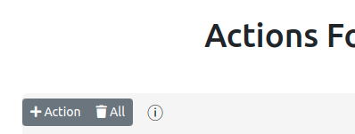
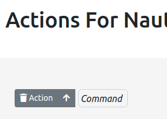

# Actions For Nautilus

The Actions For Nautilus extension allows you to add items to the Gnome Files
(called Nautilus from here-on, to avoid confusion) context (right click) menu 
based upon the characteristics of the files and directories (simply called 
_files_ from here-on) that you have selected.

Within the context of the extension, these menu items are called _actions_.

You can add two types of actions.

* Commands - a command action allows you to execute an arbitrary command, passing
  the selected files to the command as arguments.
* Menus - a menu action contains other actions, allowing you to structure your
  configured commands into logical groups in any way you see fit.

The configuration of the extension is, effectively, the declaration of the menu and
command actions that you wish to see in the Nautilus context menu for different types 
of files.

The details of the configuration file itself can be found in the project documentation.
This help information is intended to help you use the configurator tool to create and
modify the configuration.

## Layout
The configurator UI is basically layed out in two columns:

* The left most column shows you the current items that will be added to the Nautilus context menu.
  
  

  This allows you to: 
  
  * see the actions already added to the main context menu, 
  * add new actions to that menu
  * select an existing action in order to edit its characteristics
  * remove all actions from the main menu (which removes all actions from the entire configuration)

  It also allows you to set the ordering options for the main menu actions, and to set the debug
  output option if you need to resolve problems with your configuration.

* The right column shows the details and characteristics of the currently selected main menu item
  in the left-most column

  

  Here you:

  * set the type of the selected action - _Menu_ or _Command_
  * set the label for the action
  * set the submenu items for a menu action
  * set the command string, cwd, and filter rules that pertain to a command action
  * reorder the action within its containing menu
  * delete the action

Of special note is the **Submenu Actions** tab for menu actions ... this presents the identical UI
elements in a nested format - i.e. the creation and manipulation of submenu actions is exactly
the same as for main menu items, performed within the ui presented by the **Submenu Actions** tab.

The instructions below are presented for main actions, but the same semantics apply to creating
submenu actions

## Menu Actions
To create a menu action, then, do the following:

* click on the **+ Action** button at the top of the left-most column of the configurator
  tool:

  

* In the newly-created action details area (to the right), click on the type indicator
  box,

  

  and change it to _Menu_

You will now see the tabs that are relevant to menu actions:

You will also notice that the selection item in the left column has a new icon:

 instead of .

You must now give your menu a label, which should be unique among all actions at the
nesting level to which you are adding the menu.

You can also opt to have the extension sort the actions that will appear in this new menu
in alphanumeric order (the default is that the order you specify is the one that is used).

To add actions to your new menu, click on the **Submenu Actions** tab to reveal a nested 
dialog that is similar to the top level dialog. Here you can, again, click on the 
 to configure the actions that will appear in your 
newly created menu.

That is all there is to menu creation.

However, your menu will not appear in the Nautilus context menu until you add command
actions to it, and then only if those commands are pertinent to the files that you have 
selected in the Nautilus window.

## Command Actions

