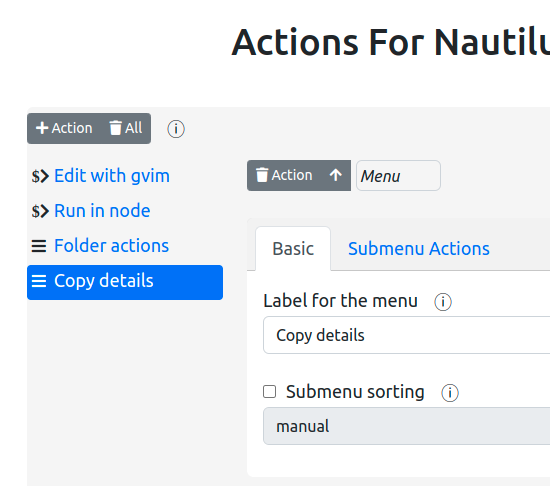
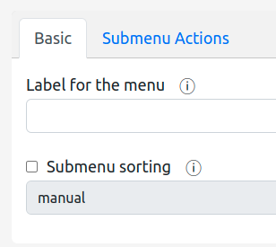
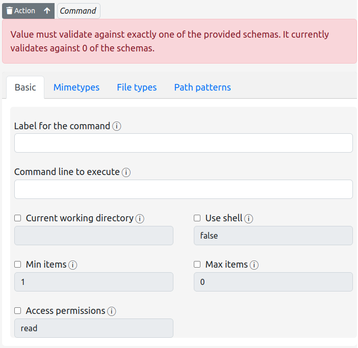
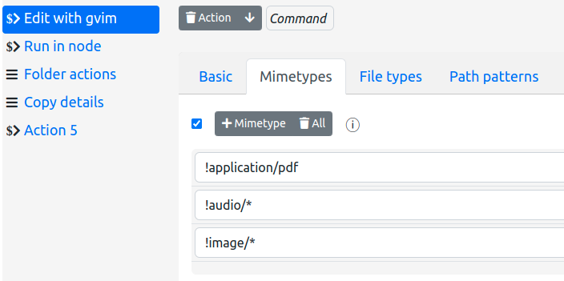
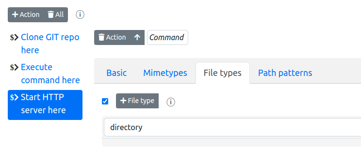
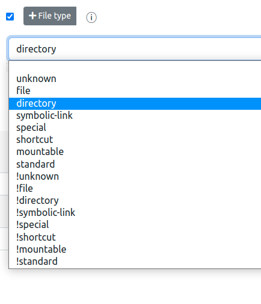
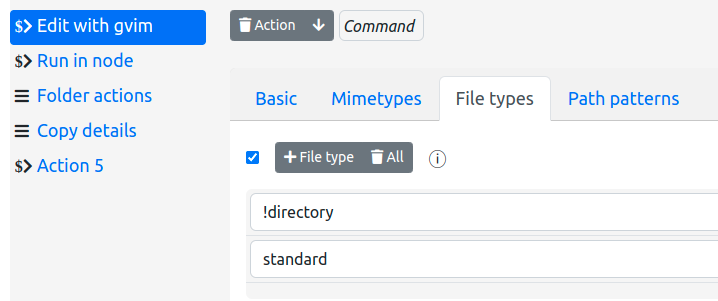

# Actions For Nautilus

The Actions For Nautilus extension allows you to add items to the Gnome Files
(called Nautilus from here-on, to avoid confusion) context (right click) menu 
based upon the characteristics of the files and directories (simply called 
_files_ from here-on) that you have selected.

Within the context of the extension, these menu items are called _actions_.

You can add two types of actions.

* Commands - a command action allows you to execute an arbitrary command, passing
  the selected files to the command as arguments.
* Menus - a menu action contains other actions, allowing you to structure your
  configured commands into logical groups in any way you see fit.

The configuration of the extension is, effectively, the declaration of the menu and
command actions that you wish to see in the Nautilus context menu for different types 
of files.

The details of the configuration file itself can be found in the project documentation.
This help information is intended to help you use the configurator tool to create and
modify the configuration.

## Layout
The configurator UI is basically layed out in two columns:

* The left most column shows you the current items that will be added to the Nautilus context menu.
  
  

  This allows you to: 
  
  * see the actions already added to the main context menu, 
  * add new actions to that menu
  * select an existing action in order to edit its characteristics
  * remove all actions from the main menu (which removes all actions from the entire configuration)

  It also allows you to set the ordering options for the main menu actions, and to set the debug
  output option if you need to resolve problems with your configuration.

* The right column shows the details and characteristics of the currently selected main menu item
  in the left-most column

  

  Here you:

  * set the type of the selected action - _Menu_ or _Command_
  * set the label for the action
  * set the submenu items for a menu action
  * set the command string, cwd, and filter rules that pertain to a command action
  * reorder the action within its containing menu
  * delete the action

Of special note is the **Submenu Actions** tab for menu actions ... this presents the identical UI
elements in a nested format - i.e. the creation and manipulation of submenu actions is exactly
the same as for main menu items, performed within the ui presented by the **Submenu Actions** tab.

The instructions below are presented for main actions, but the same semantics apply to creating
submenu actions

## Menu Actions
To create a menu action, then, do the following:

* click on the **+ Action** button at the top of the left-most column of the configurator
  tool:

  

* In the newly-created action details area (to the right), click on the type indicator
  box,

  

  and change it to _Menu_

You will now see the tabs that are relevant to menu actions:

You will also notice that the selection item in the left column has a new icon:

 instead of .

You must now give your menu a label, which should be unique among all actions at the
nesting level to which you are adding the menu.

You can also opt to have the extension sort the actions that will appear in this new menu
in alphanumeric order (the default is that the order you specify is the one that is used).

To add actions to your new menu, click on the **Submenu Actions** tab to reveal a nested 
dialog that is similar to the top level dialog. Here you can, again, click on  
 to configure the actions that will appear in your 
newly created menu.

That is all there is to menu creation.

However, your menu will not appear in the Nautilus context menu until you add command
actions to it, and then only if those commands are pertinent to the files that you have 
selected in the Nautilus window...

## Command Actions
Command actions are really what this is all about - executing a command string of your choice
passing details of the file(s) you have selected as arguments to the command.

Examples of commands:

* Start an HTTP server using a specific folder as the root folder
* Restore the previous version of a versioned file
* Copying details of the selected files to the clipboard
* Running a script file with an appropriate interpreter
* Executing an arbitrary command in a selected folder
* ...

Using tools such as Zenity, XClip, Gnome Terminal, and others, you can construct complex
scenarios and even pipelines that are then executed with a simply click on the Nautilus
context menu item

### Creating a Command Action
You create a command action in the same way you create a menu action - 

* click on the **+ Action** button at the top of the left-most column of the configurator
  tool:

  

* In the newly-created action details area (to the right), click on the type indicator
  box and change it to _Command_

Upon creating the action, you see the details that can be specified for the command:

Firstly give your command a label, which should be unique within the menu/submenu to which
you are adding the command.

And, evidently, you must provide a command line to execute with the action is clicked on.
We'll cover that below.

Firstly, however, we'll cover the rules that dictate if a command action is appropriate to the
current files in the Nautilus selection.

### Filtering rules
Actions For Nautilus can filter the Nautilus selection to decide if a specific command action
should be available to that selection.

This filtering can apply four different criteria:

* The number of files in the selection 
* The mimetypes of the selected files
* The basic filetypes of the selected files
* The paths of the selected files

Firstly note that each of these is optional - if not used, the action applies to a selection
of any size, any file type, any mimetype, and any path.

As with other optional configuration items, in order to apply a filter, you must first activate 
the filter by checking the checkbox situated next to the entry field.

After that, you can start adding filter rules.

It is important to note that _all_ files in the selection must pass the filtering rules in 
order for the action to be shown in the Nautilus context menu.

It is also important to note that if none of the actions in a submenu are applicable to the
current selection, that submenu will not appear in the Nautilus context menu.

#### Max items
This is pretty simple to explain: the maximum number of files that are in the selection in order 
for the command action to be shown.

Normally you will looking at values of either **0** - meaning unlimited - or **1** meaning ... well ...
1. However, other values can be used. For example, for an action that compares two files, you might
want to specify a value of **2** here.

Note that, at present, there is no capability to specify an exact number other that **1**.

#### Mimetypes

With the mimetypes list, entered in the **Mimetypes** tab, you can specify the IANA Media Types 
to which your command action applies. E.g.

In this example, the **Run in node** action only applies to files whose mimetype is **application/javascript**.

You can specify any number of mimetypes - the selected files must match one of these in order to pass the
mimetypes filter rule.

A mimetype can be declared in one of the ways standard to IANA Media Types:

* _type/subtype_ - a specific mimetype (e.g. **application/javascript** as in the above example)
* _type/\*_ - all subtypes of a specific type 'e.g. **audio/\*** for audio files of any encoding)

You can specify **\*** or **\*/\*** to specify all mimetypes - but since this is the default setting
it's a bit superfluous to do so!

You can make a mimetype _"negative"_ by preceding it with an exclamation point, in order to declare 
that NONE of the selected files should be of the specified mimetype(s). E.g.

In this example, the **Edit with gvim** action will not appear if any of the selected files is a PDF, an 
audio file, or an image file.

You should probably avoid mixing standard (positive) rules with negative rules, since the result could
be confusing, but the algorithm is fairly straightforward:

* All selected files must match one of the "positive" rules and none of the "negative rules".

#### File types

With the file types list, entered in the **File types** tab, you can specify the Gnome file type. 
to which your command applies. E.g.

In this example, the **Start HTTP server here** action only applies to directories.

The available filetypes are defined by Gnomeitself and are, therefore, presented in a selection list:

You will notice that "negative" versions of the file types are also available - the selected files must
NOT be of such file types.

The most useful filetypes are likely to be `directory`, `file` and `symbolic link` and, as such, a
"macro" filetype is available - `standard` which encapsulates all three.

As with [mimetypes](#mimetypes), mixing negative and standard rules could be confusing, however
there is a use ful case for a such a mix:

This configuration specifies all `standard` types EXCEPT directories/folders -  sensible filter for a
an editor command.

#### Path patterns

With the path patterns list, entered in the **Path patterns** tab, you can state that the paths
of the files in the selection should match certain patterns. E.g.

In this example, the **Edit with gvim** action only applies to files that are in the user jdoe's home 
directory.

Patterns can be entered as "GLOB" patterns, or regular expressions.

* Glob Patterns allow you specify placeholders in the pattern string, as follows:

  * **\*** - indicating any number of characters
  * **?** - indicating any single character
  * **[abcd] - indicating any character in the set of characters between the brackets
  * **[!abcd] - indicating _not_ any character in the set of characters between the brackets
  * All other characters are literal

  The above example is a glob pattern.

  Globs are simple but limited - on the other hand most needs can be expressed accurately enough
  using them

  Note that GLOB patterns inherently match against the _whole_ path name - so, for example, a 
  path of `/etc/home/jdoe/myfile` would _not_ match the above example.

* Regular expressions allow for a far more complex pattern to be expressed. It is beyond the 
  scope of this document to explain regular expressions, but the extension specifically supports
  the regular expression syntax implemented by Python. Documentation of this syntax is available
  elsewhere.

  To use a regular expression, precede the pattern with the tag `re:`:

  

  This example specifies the same rule as the glob example above as a regular expression ...

  welllll - not quite .... 

  Regex patterns do not inherently match against the _whole_ path name - so, for example, a 
  path of `/etc/home/jdoe/myfile` _would_ match this reular expression.

  To make the pattern match the path, you need to prefix it with a carat character and suffix it with
  a a dollar character:

  

Again, you can prefix the entire pattern string with an exclamation point to specify a "negative"
path pattern - no file in the selection should have a path that matches that pattern - and again 
mixing standard and negative rules _may_ be confusing, but may also be useful in breaking down
complex patterns into simpler components.